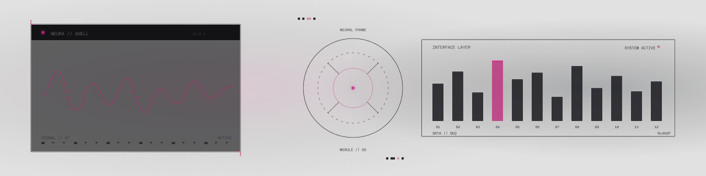

<div align="center">
  
</div>

<br>

<div align="center">


</div>

<br>

<!-- ═══════════════════════════════════════════════════════════════ -->
<!-- SYSTEM STATUS                                                   -->
<!-- ═══════════════════════════════════════════════════════════════ -->

```yaml
# ─── SYSTEM STATUS ───────────────────────────────────────────────
unit:          Aurélio
class:         Developer / Student
base:          São Paulo, BR
affiliation:   Instituto Federal de São Paulo (IFSP)
status:        ONLINE
progress:      ████████████████████ 100%
````

<br>

<!-- ═══════════════════════════════════════════════════════════════ -->

<!-- ARSENAL — TECH STACK                                            -->

<!-- ═══════════════════════════════════════════════════════════════ -->

<div align="center">

### `▸ ARSENAL`

<br>

<table>
<tr>
<td align="center" width="110">

<br> <sub><b>HTML5</b></sub>

</td>
<td align="center" width="110">

<br> <sub><b>CSS3</b></sub>

</td>
<td align="center" width="110">

<br> <sub><b>JavaScript</b></sub>

</td>
<td align="center" width="110">

<br> <sub><b>Tailwind</b></sub>

</td>
<td align="center" width="110">

<br> <sub><b>Java</b></sub>

</td>
</tr>

<tr>
<td align="center" width="110">

<br> <sub><b>C</b></sub>

</td>
<td align="center" width="110">

<br> <sub><b>MySQL</b></sub>

</td>
<td align="center" width="110">

<br> <sub><b>Git</b></sub>

</td>
<td align="center" width="110">

<br> <sub><b>Figma</b></sub>

</td>
<td align="center" width="110">

<br> <sub><b>VS Code</b></sub>

</td>
</tr>
</table>

</div>

<br>

<!-- ═══════════════════════════════════════════════════════════════ -->

<!-- COMBAT DATA — GITHUB STATS                                      -->

<!-- ═══════════════════════════════════════════════════════════════ -->

<div align="center">

### `▸ COMBAT DATA`

<br>

<a href="https://github.com/Aurelio-Dev">
  
</a>
<a href="https://github.com/Aurelio-Dev">
  
</a>

<br><br>


</div>

<br>

<!-- ═══════════════════════════════════════════════════════════════ -->

<!-- ACTIVITY GRAPH                                                  -->

<!-- ═══════════════════════════════════════════════════════════════ -->

<div align="center">

### `▸ ACTIVITY GRID`

<br>


</div>

<br>

<!-- ═══════════════════════════════════════════════════════════════ -->

<!-- TRANSMISSION — CONTACT                                          -->

<!-- ═══════════════════════════════════════════════════════════════ -->

<div align="center">

### `▸ TRANSMISSION`

<br>

[](mailto:ruotolooaurelioo@gmail.com)
[](https://github.com/Aurelio-Dev)

</div>

<br>

<!-- ═══════════════════════════════════════════════════════════════ -->

<!-- VISITOR COUNT                                                   -->

<!-- ═══════════════════════════════════════════════════════════════ -->

<div align="center">

```txt
───────────────────────────────────────────────────
SESSION ACTIVE · PROFILE INTERFACE ONLINE
───────────────────────────────────────────────────
```


</div>

<!-- EOF -->

```
```
